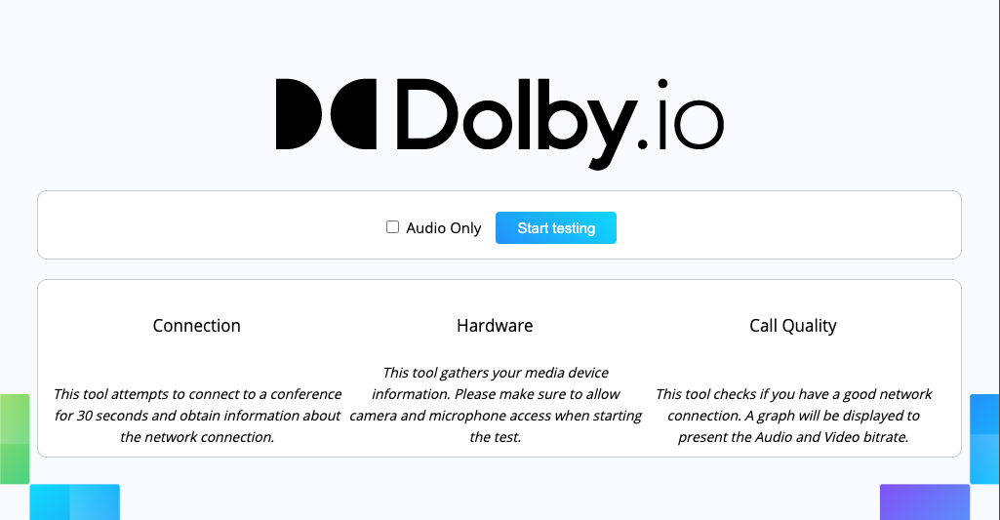
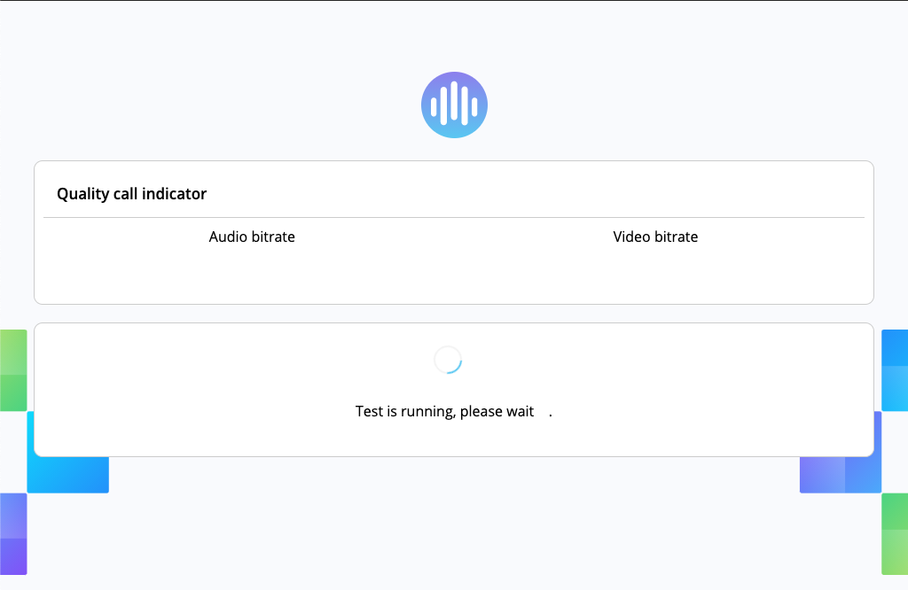

# Dolby<span>.io</span> Call Tester

<p align="center">

</p>

This project is a pre-call tester to check client readiness for connecting to dolby<span>.io</span>. The tool will check network, devices, and available network bandwidth for audio and video traffic.

## Project setup

 - Clone this repository.
 - Get your Dolby<span>.io</span> consumerKey and consumerSecret from our [Developer Portal](https://dolby.io/dashboard/).
 - Request an access token from the REST API https://docs.dolby.io/communications-apis/reference/get-client-access-token

## Initializing the project

Run the following command to install all the dependencies required to run the project:

```bash
yarn install
```

## Running the project

Run the following command to start the project:

```bash
yarn start
```

The project is now running, go to: http://localhost:8081 and provide the access token in the first text box to initialize the SDK.

## Building the project

If you want to generate a bundle file that you can deploy on a web server, run the following command:

```bash
yarn run build
```

Get the files in the `dist` folder and deploy them on your web server.

## Run a test

Run the project and go to the web page http://localhost:8081, you should get the following screen:

<p align="center">

</p>

Click the _Start testing_ button, the test will begin.

<p align="center">

</p>

After about 30 seconds, you will see the result showing up on the screen.

<p align="center">

</p>

## GitHub Pages

You can test this project directly on our GitHub pages: https://dolbyio-samples.github.io/comms-sdk-web-call-tester/
